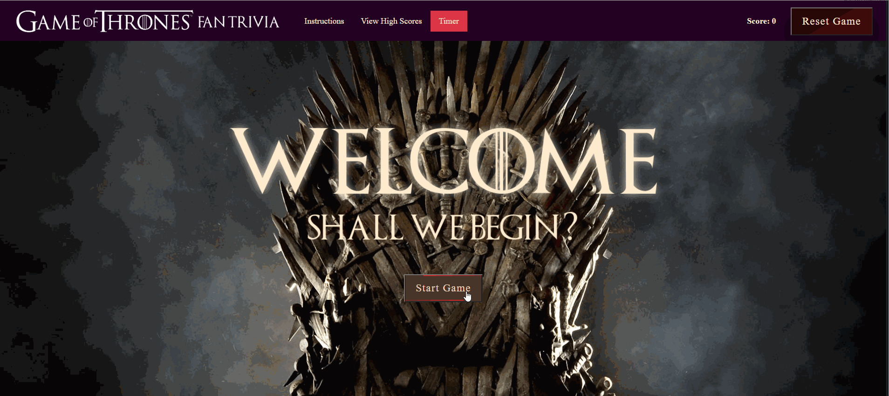

### Game of Thrones Fan Trivia Quiz

This site was built for a Berkeley Coding Boot Camp assignment which required use of Javascript and jQuery to learn to manipulate the DOM.  It's a simple interactive quiz designed to test your knowledge of the blockbuster HBO series "Game of Thrones."  Once you click start, you'll have 50 seconds to choose from several answers.  If you answer incorrectly, you'll get a time penalty and 15 seconds will be taken off the clock.  

This version is a modest cleanup of my [original project](#original).  It was the very first Javascript assignment, created early in the course, and earlier versions didn't function properly.  Amazing to see how much was learned in a few months since this was first written.

## Contents | Quick Links
[Getting Started](#start)     |     [Demo](#demo)     |     [Built With](#built)     |     [Authors](#author)     |     [Visuals](#visuals)     |     [Contributing & Tests](Contributing.md)     |     [Contact](#contact)

## [Getting Started](#start)

### Download the app from the Git Hub repo here:
* [github.com/jenjayme/new-GOT-quiz](https://github.com/jenjayme/new-GOT-quiz)

### <a id="demo">View a demo here:</a> 
* [jenjayme.github.io/new-GOT-quiz](https://jenjayme.github.io/new-GOT-quiz/#demo)

## [Visuals](#visuals)

## <a id="built">Built With</a>
* HTML5 & CSS
* [Javascript](https://www.javascript.com/)
* [Bootstrap](https://getbootstrap.com/)
* [VS Code](https://code.visualstudio.com/)
* [Node.js](https://nodejs.org/)

## <a id="original">Original Version</a>
My first version of the assignment had several glitches preventing key functions.  I was still wrestling to learn how to build stateful components.  You can see an earlier version at the links below. 
* [Version 1 Repo](https://github.com/JenJayme/quiz-game/)
* [Version 1 Deployed](https://jenjayme.github.io/quiz-game/)

## <a id="contact">Questions</a>
For questions or to discuss collaborations on this or other projects, contact the author via LinkedIn or GitHub as follows.

## <a id="author">Author</a>

**Jen Jayme** 
[linkedin.com/jenjayme](https://www.linkedin.com/in/jenjayme) 
[github.com/jenjayme](https://github.com/JenJayme)

## Acknowledgements
* Special thanks to Jerome Chenette, UC Berkeley Coding Boot Camp and Trilogy Education Services for referring this project.
* Shout out to Fred Rodolfo for critical tutoring advice and support.
* Props to the Game of Thrones cast and producers for many hours of entertainment, except for the end of Season 8.