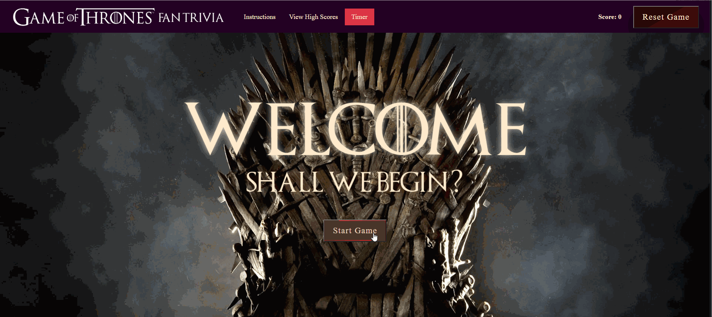

### Game of Thrones Fan Quiz

This is a slightly cleaned up version of my earliest javascript assignment for  Berkeley Coding Boot Camp.  The challenge, posed in week 3, was to create a timed quiz game with interactions produced primarily through DOM manipulation using vanilla Javascript and jQuery, and include a high scores record.  I've done some cleanup of the code to make it work properly.  As time permits, plans for enhancement include adding more questions, more dynamic features, replacing simple alert boxes with nicer modals, and rewriting the traditional For Loops with map functions.  

Additions and collaborations from other GOT fans are welcome!

## Contents | Quick Links
[Getting Started](#start)     |     [Demo](#demo)     |     [Built With](#built)     |     [Authors](#author)     |     [Visuals](#visuals)     |     [Contributing & Tests](Contributing.md)     |     [Contact](#contact)

## [Getting Started](#start)

### <a id="demo">View a demo here:</a> 
* [Deployed on GitHub Page](https://jenjayme.github.io/new-GOT-game/#demo)

### Download from the repo here:
* [Git Hub Repo](https://github.com/jenjayme/new-GOT-game)

## [Visuals](#visuals)

## <a id="built">Built With</a>
* HTML5 & CSS
* [Javascript](https://www.javascript.com/)
* [Bootstrap](https://https://getbootstrap.com/)
* [VS Code](https://code.visualstudio.com/)

## <a id="contact">Questions</a>
For questions or to discuss collaborations on this or other projects, contact the author via LinkedIn or GitHub as follows.

## <a id="author">Author</a>

**Jen Jayme** 
[linkedin.com/jenjayme](https://www.linkedin.com/in/jenjayme) 
[github.com/jenjayme](https://github.com/JenJayme)

## Acknowledgements
* Special thanks to Jerome Chenette, UC Berkeley Coding Boot Camp and Trilogy Education Services for referring this project.
* Endless appreciation to Fred Rodolfo for tutoring advice and support.
* Shout out to Alex Bodin for the cool animated button styling.